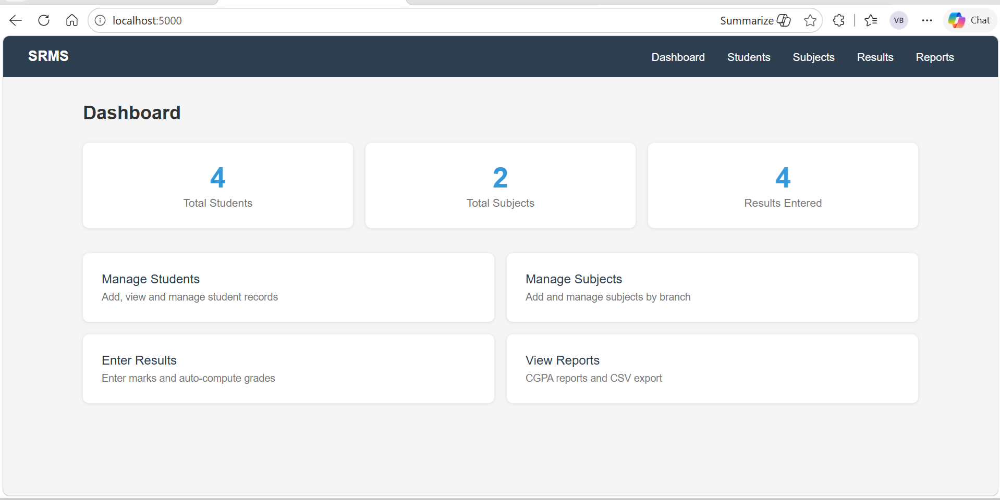

# 🎓 Student Result Management System

A full-stack web application built with **Python (Flask)**, **HTML/CSS**, and **SQLite** for managing student academic results, generating report cards, and automating grade calculations.

## ✨ Features

- **Student Management** — Add, edit, delete, and search students
- **Subject Management** — Manage subjects per branch and semester
- **Result Entry** — Enter marks with automatic grade computation
- **Report Generation** — Real-time report cards with CGPA calculation
- **CSV Export** — Download student report cards as CSV
- **Input Validation** — Server-side validation on all forms

## 🛠️ Tech Stack

| Layer    | Technology          |
|----------|---------------------|
| Backend  | Python 3.x, Flask   |
| Frontend | HTML5, CSS3         |
| Database | SQLite (built-in)   |

## 📁 Project Structure

```
student_result_system/
├── app.py                  # Flask app — all routes and logic
├── requirements.txt        # Python dependencies (Flask only)
├── student_result.db       # SQLite database (auto-created on first run)
├── static/
│   └── css/style.css       # Styles
└── templates/
    ├── base.html
    ├── index.html
    ├── students.html
    ├── student_form.html
    ├── subjects.html
    ├── subject_form.html
    ├── results.html
    ├── result_form.html
    └── reports.html
```

## 🚀 Setup & Run

### Prerequisites
- Python 3.8+ (that's it — no database installation needed!)

### Step 1: Clone the repository
```bash
git clone https://github.com/YOUR_USERNAME/student-result-management-system.git
cd student-result-management-system
```

### Step 2: Install dependencies
```bash
pip install -r requirements.txt
```

### Step 3: Run the app
```bash
python app.py
```

Visit: **http://127.0.0.1:5000** 🎉

The database is created automatically on first run with sample data!

## 🗄️ Database Design

### Tables
- **Students** — Roll number, name, branch, semester, academic year
- **Subjects** — Subject code, name, branch, credits, max marks
- **Results** — Marks per student per subject with exam year

### Grading Scale
| Grade | Percentage |
|-------|-----------|
| O     | ≥ 90%     |
| A+    | ≥ 80%     |
| A     | ≥ 70%     |
| B+    | ≥ 60%     |
| B     | ≥ 50%     |
| C     | ≥ 40%     |
| F     | < 40%     |
## Screenshots



## 👩‍💻 Author

**Velagala Sai Bhaskari**  
Programmer Analyst | Python | C# | SQL Server  
[Email](mailto:chinnuvelagala26@gmail.com)
